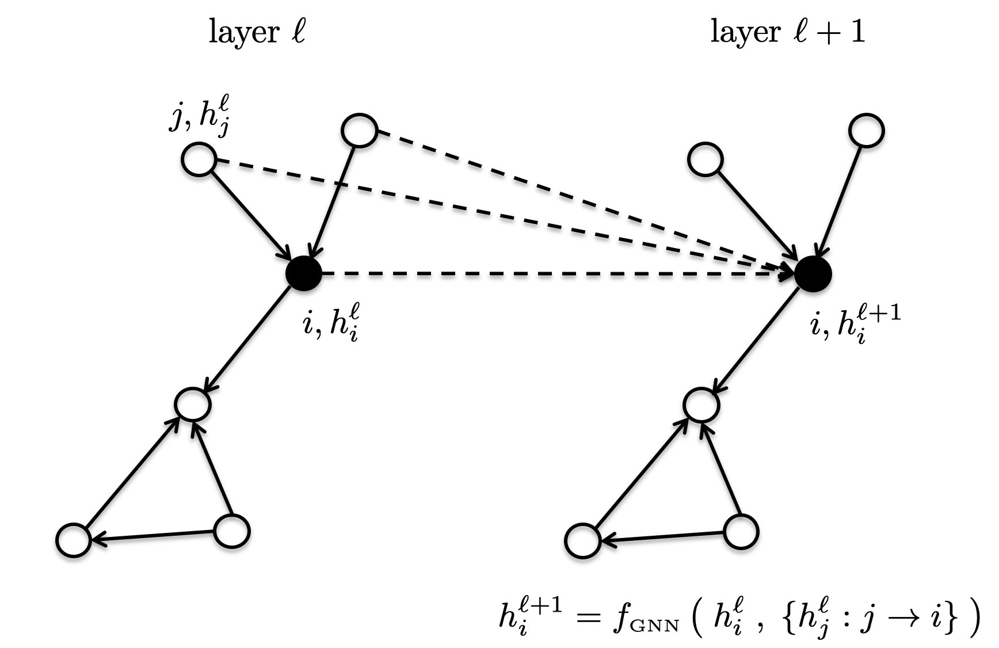

# Benchmarking Graph Neural Networks

<br>

## Updates
****

**Dec 25, 2022**
* Added docker file to set up the environment for CPU and GPU platforms.
* Added OGBG (https://ogb.stanford.edu/docs/graphprop/) and OGBN (https://ogb.stanford.edu/docs/nodeprop/) dataset with scripts
* Added support for GNN inference
* Added support on data generation during inference for each layer. These generated data will be used by the HLS kernels in GNNHLS.
* To perform this extension for GNN inference and/or training, user can use one of the shell scripts for CPU/GPU and OGBG/OGBN. for example, To perform it for OGBG on CPU, you can use this command: `./run_cpu_inference_OGBG.sh`. To perform it for OGBG on GPU, you can use this command: `./run_gpu_inference_OGBG.sh`. The same rule applies for OGBN.
* The newly generated data files will be located at ./out_new/\<outdir defined at the config file>/data/
* Added dockerfiles (./dockerfile/): Dockerfile_cpu_16.04 for CPU platforms; Dockerfile_gpu_16.04_cuda10.0 for GPU platform.
* Updated conda configuraiton files. To run the conda configuration file, execute `./dockerfile/env_cpu.sh` for CPU platforms and `./dockerfile/env_gpu.sh` for GPU platforms.


**Jun 11, 2020**
* Second release of the project. Major updates : 
	+ Added experimental pipeline for Weisfeiler-Lehman-GNNs operating on dense rank-2 tensors.
	+ Added a leaderboard for all datasets.
	+ Updated PATTERN dataset.
	+ Fixed bug for PATTERN and CLUSTER accuracy.
	+ Moved first release to this [branch](https://github.com/graphdeeplearning/benchmarking-gnns/tree/arXivV1).
* New ArXiv's version of the [paper](https://arxiv.org/pdf/2003.00982.pdf).


**Mar 3, 2020**
* First release of the project.


<br>




## 1. Benchmark installation

[Follow these instructions](./docs/01_benchmark_installation.md) to install the benchmark and setup the environment.


<br>

## 2. Download datasets

[Proceed as follows](./docs/02_download_datasets.md) to download the benchmark datasets.


<br>

## 3. Reproducibility 

[Use this page](./docs/03_run_codes.md) to run the codes and reproduce the published results.


<br>

## 4. Adding a new dataset 

[Instructions](./docs/04_add_dataset.md) to add a dataset to the benchmark.


<br>

## 5. Adding a Message-passing GCN

[Step-by-step directions](./docs/05_add_mpgcn.md) to add a MP-GCN to the benchmark.


<br>

## 6. Adding a Weisfeiler-Lehman GNN

[Step-by-step directions](./docs/06_add_wlgnn.md) to add a WL-GNN to the benchmark.


<br>

## 7. Leaderboards

[Leaderboards](./docs/07_leaderboards.md) of GNN models on each dataset. [Instructions](./docs/07_contribute_leaderboards.md) to contribute to leaderboards.


<br>

## 8. Reference 

[ArXiv's paper](https://arxiv.org/pdf/2003.00982.pdf)
```
@article{dwivedi2020benchmarkgnns,
  title={Benchmarking Graph Neural Networks},
  author={Dwivedi, Vijay Prakash and Joshi, Chaitanya K and Laurent, Thomas and Bengio, Yoshua and Bresson, Xavier},
  journal={arXiv preprint arXiv:2003.00982},
  year={2020}
}
```


<br><br><br>

